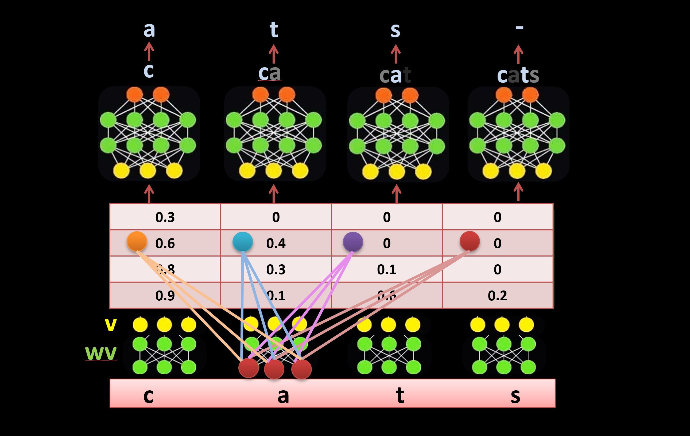

# Reweight GPT

An alternative to the self-attetnion mechanism in Tranformer achitechture.
It uses learnable lateral connections to reweight the inputs directly instead of the self-attention mechanism (as illustrated below).
To learn more about the method, watch this video (from 41:26):
https://youtu.be/l-CjXFmcVzY

# Files:
1. neural_network_tutorials.ipynb (A step by step tutorial from the basics to GPT).
2. reweight-gpt.py (A multi-block GPT implimentation using direct re-weighting of the attention matrix).
3. reweight-gpt-nonlinear.py (A nonlinear version of the direct re-weighting method. For easy comparsion between the two methods, I adapted this script directly from Andrej Karpathy's GPT implimentation).

# Illustration:

